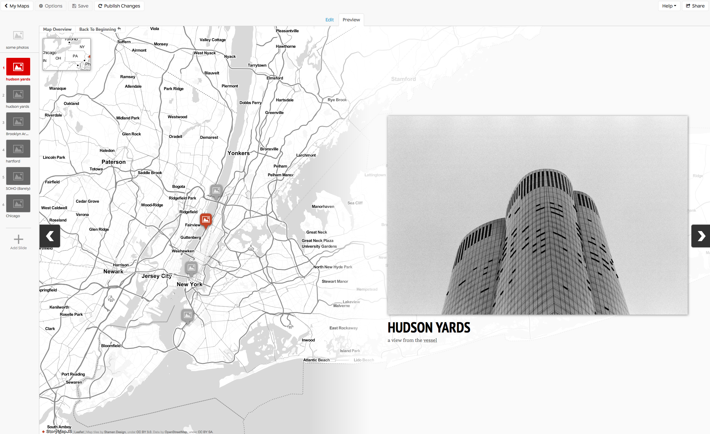
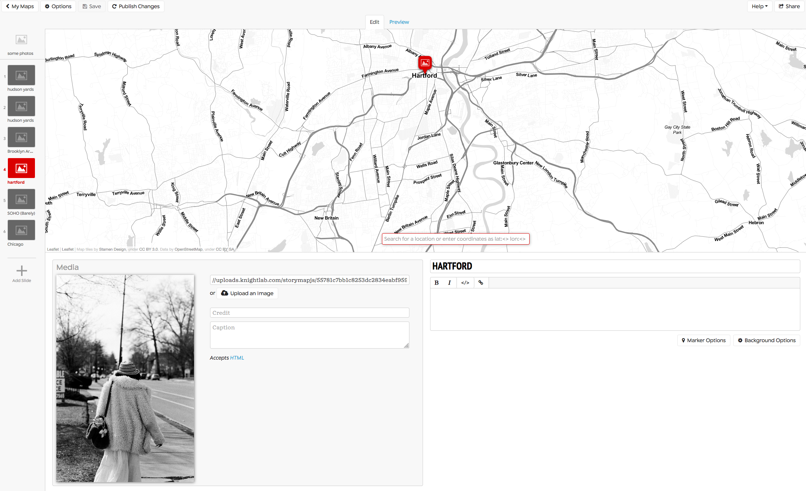
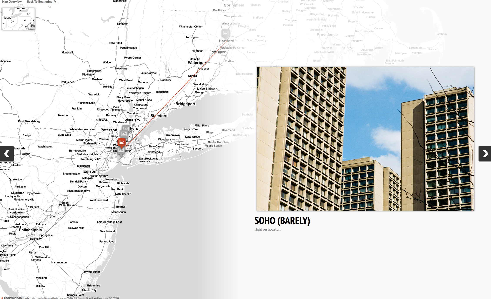
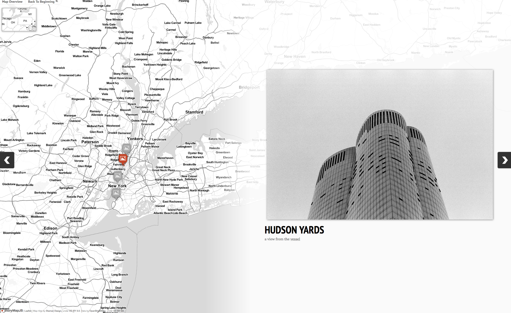

## a free tool created by the folks at [knightlab](https://knightlab.com) to help journalists tell stories on the web that highlight the locations in a series of events. during a summer, I made a number of contributions and improvements to thte tool. namely, by creating local development for github contributors, fixing bugs, improving documentation and updating the user interface.

