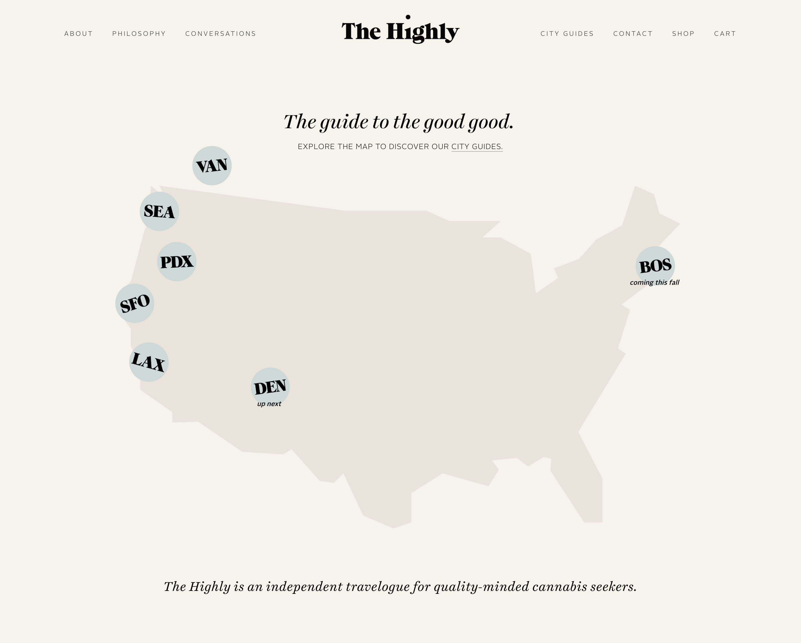
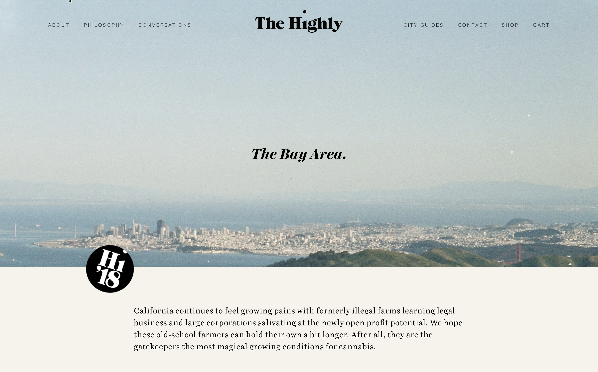
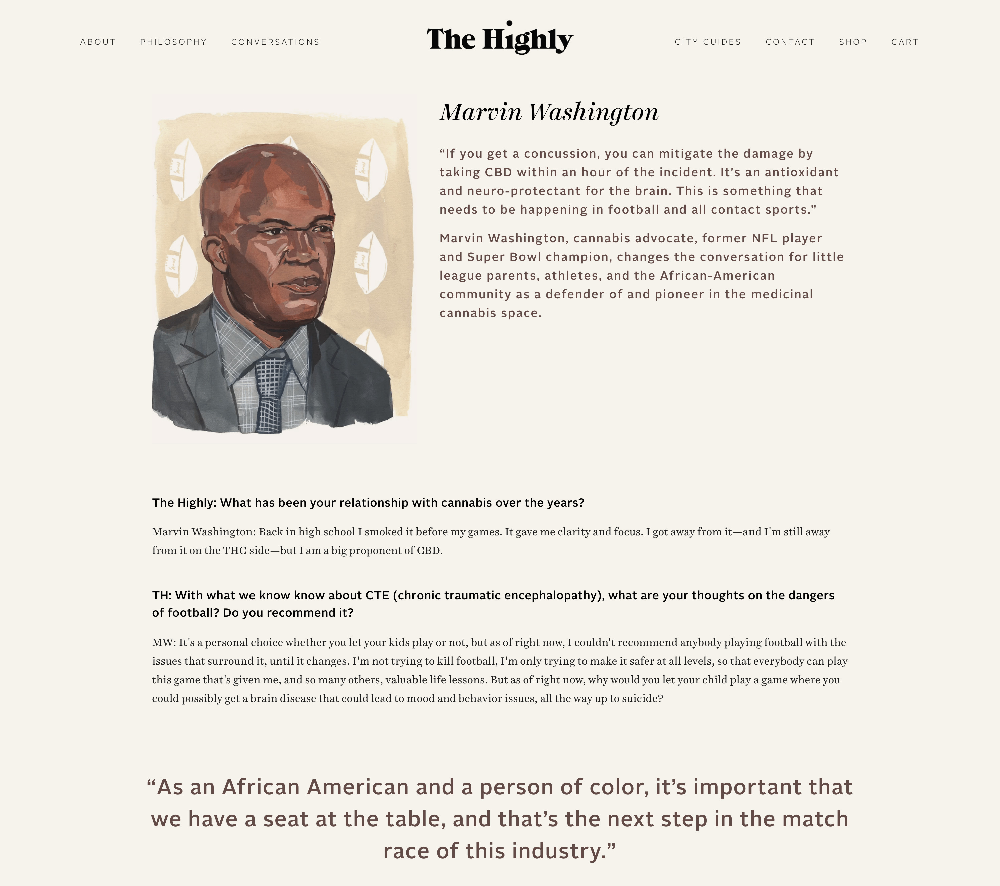
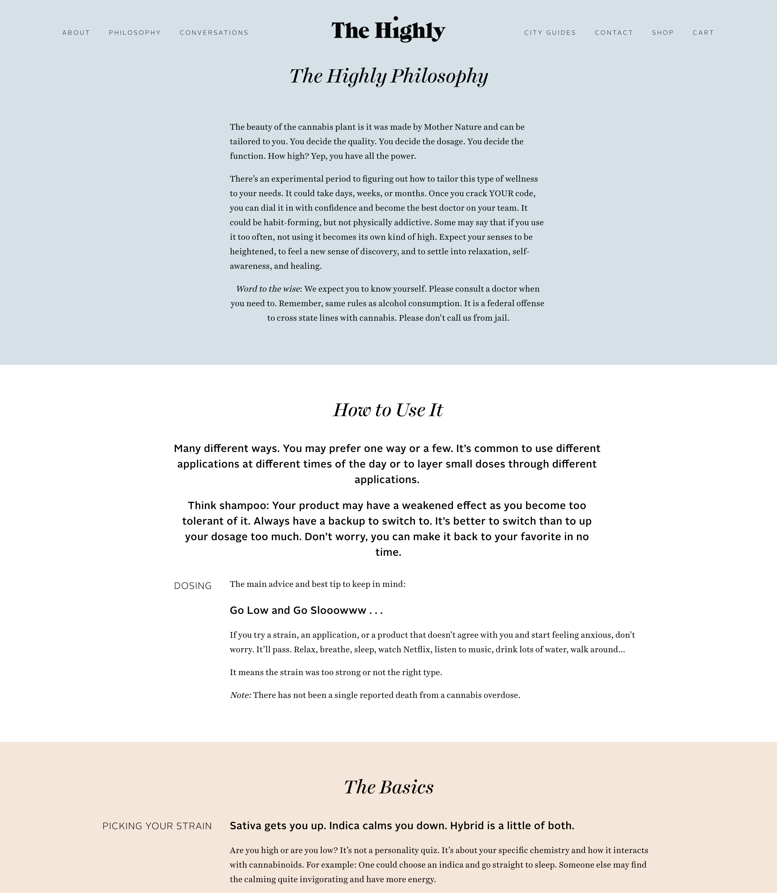
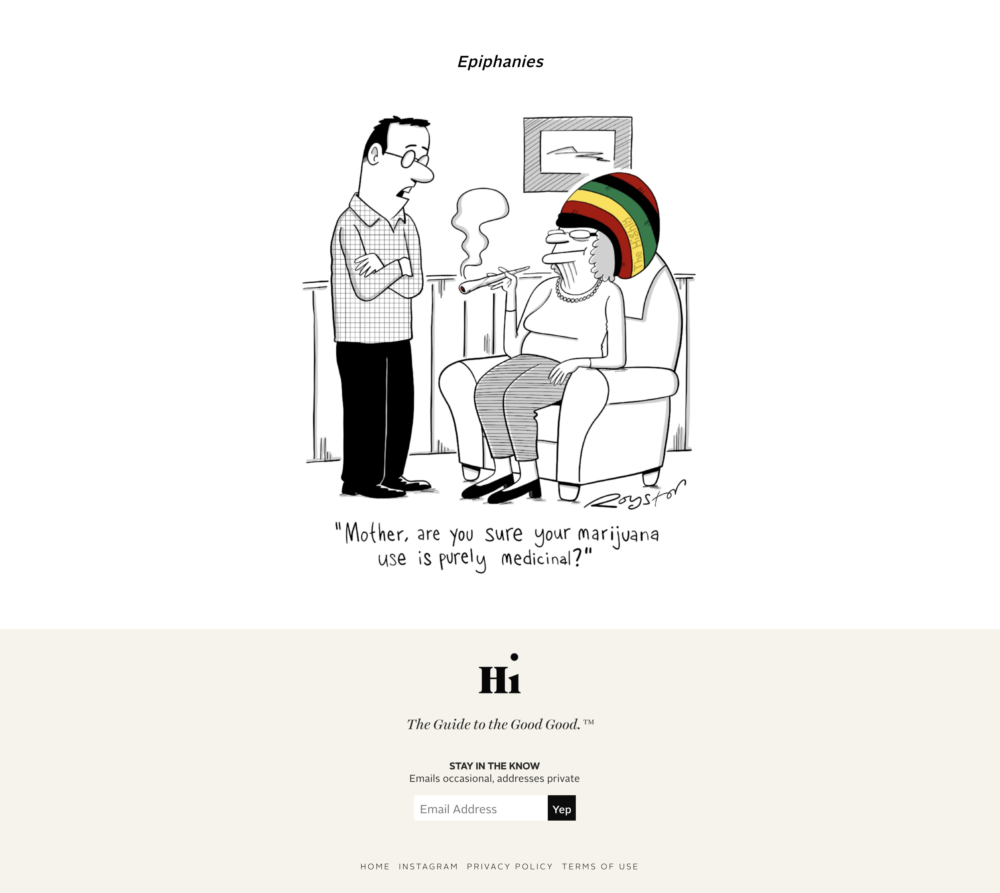

## a website hosting the interviews, travel guides and product reviews of the cannabis editorial, [the highly](https://www.instagram.com/thehighly/). working with my partner, [teah](https://www.teahkbrands.com), i co-designed, developed and managed the website,  seo, newsletter and subscriber funnel.

## the highly has since restructed to focus exclusively on the newsletter. however, you can see image of our work below, and interact with the old website [here](https://web.archive.org/web/20180908055811/https://www.thehighly.co/).

